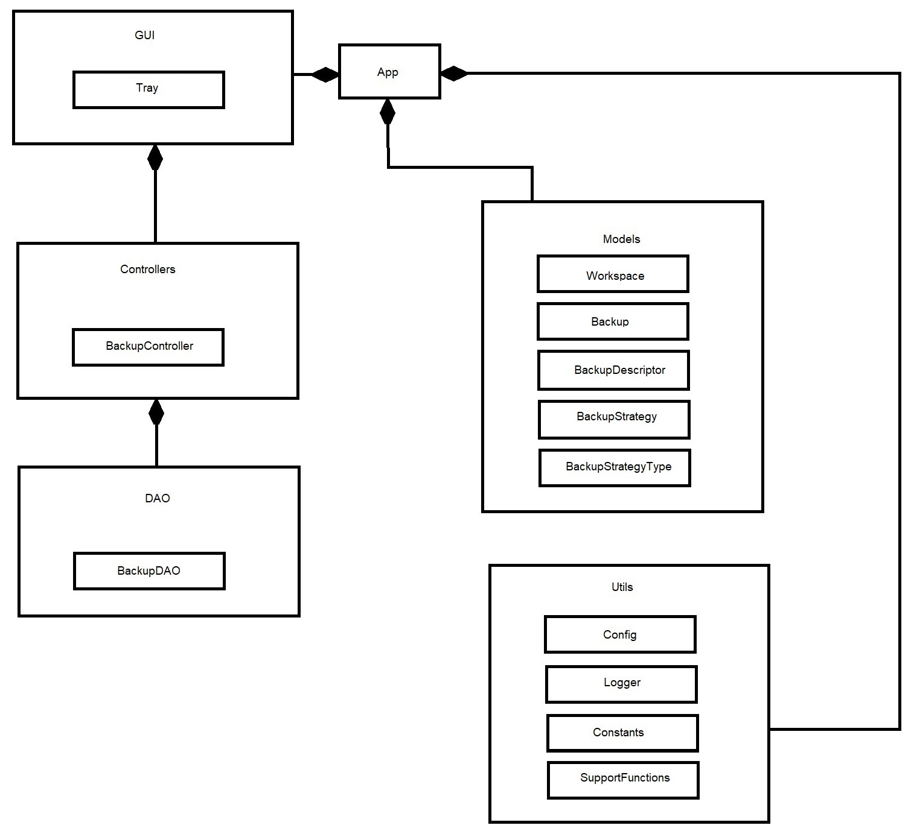

# ShodanEye

***

## Содержание

- [Содержание](#содержание)
- [1 - Функциональные возможности приложения](#1---функциональные-возможности-приложения)
- [2 - Выбор архитектуры приложения](#2---выбор-архитектуры-приложения)
- [3 - Выбор языка программирования](#3---выбор-языка-программирования)
- [4 - Технологии хранения данных](#4---технологии-хранения-данных)
- [5 - Набор элементов системы](#5---набор-элементов-системы)
- [6 - Схема хранения данных](#6---схема-хранения-данных)
- [7 - Перечень вспомогательных инструментов](#7---перечень-вспомогательных-инструментов)

***

## 1 - Функциональные возможности приложения

Утилита ***ShodanEye*** предназначена для автоматического запланированного создания резервных копий файлов
и папок. 

Приложение имеет следующий функционал:

* **Резервирование файлов и папок**
* **Использование временных меток/префиксов/постфиксов/версий в резервных копиях**
* **Архивирование резервных копий**
* **Проверка целостности резервных копий**
* **Планирование автоматического резервирования**
* **Автоматическое резервирование по изменениям в отслеживаемых файлах и папках**
* **Восстановление из резервных копий**
* **Поддержка групп резервных копий (позволяют одновременно резервировать различные объекты отслеживания)**

***

## 2 - Выбор архитектуры приложения

Так как в приложении обозначена необходимость взаимодействия пользователя с одним хранилищем данных
и необходимость развёртывания на единой машине, в таком случае подойдёт монолитная архитектура.

***

## 3 - Выбор языка программирования

В функциональных требованиях приложения можно четко выделить бизнес сущности приложения (резервная
копия, файл, папка, планировщик резервирования и т.д.), потому следует использовать подходящую методологию, 
в данном случае это ООП (объектно-ориентированное программирование). Приложение должно быть устойчиво к ошибкам,
что требует определенного уровня безопасности и отказоустойчивости системы,
также приложение должно иметь устойчивость к смене среды исполнения (ОС). Для всех этих целей подойдет язык Java.

***

## 4 - Технологии хранения данных

Хранение информации будет осуществляться путём архивирования и использования файловой системы
с дескрипторами резервных копий. Использовать резервную копию можно будет, как и при помощи приложения,
так и без него (используя архиватор).

Резервная копия состоит из папки, архива и файла-дескриптора.

***

## 5 - Набор элементов системы

UML:



Элементы системы:

1. **App** (точка входа в программу)
2. **Utils** (вспомогательные классы)
3. **Utils.Config** (класс предоставляющий доступ и реализующий конфигурацию приложения)
4. **Utils.Logger** (класс для журналирования событий приложения)
5. **Utils.Constants** (класс с константами приложения)
6. **Utils.SupportFunctions** (класс со вспомогательными функциями)
7. **Models** (классы моделей данных приложения)
8. **Models.Workspace** (класс модели группы резервных копий, которые относятся к одному объекту отслеживания)
9. **Models.Backup** (класс модели резервной копии)
10. **Models.BackupDescriptor** (класс модели дескриптора резервной копии (для мета-информации))
11. **Models.BackupStrategy** (класс модели стратегии резервного копирования)
12. **Models.BackupStrategyType** (перечисление с типами стратегий резервного копирования)
13. **GUI** (классы отвечающие за графический интерфейс)
14. **GUI.Tray** (класс отвечающий за отрисовку значка в панели задач)
15. **Controllers** (классы с бизнес логикой приложения)
16. **Controllers.BackupController** (класс с бизнес логикой операций резервного копирования)
17. **DAO** (классы с логикой доступа к данным)
18. **DAO.BackupDAO** (класс с логикой доступа к данным резервных копий)

***

## 6 - Схема хранения данных

Хранение резервной копий осуществляется в папке в виде архива с файлом-дескриптором.

Пример структуры резервной копии:

- директория_с_набором_резервных_копий
  - директория_с_резервной_копией
    - архив с резервной копией
    - файл-дескриптор
  - settings.conf

Для нормальной работы приложения нужен ряд файлов конфигураций.

Для настройки самого приложения используется конфигурационный файл settings.conf с настройками. Данный файл может иметь содержание, которое подобно приведённому ниже:

```text
files-check-delay=10000
tray-show-time-ms=4000
backup-folder-path=D:\\backups
dark-is-needed=false
laf-is-needed=false
log-app=true
russian-is-needed=false
```

Для настройки набора резервных копий используется конфигурационный файл settings.conf с настройками. Данный файл может иметь содержание, которое подобно приведённому ниже:

```text
backup-date-diff=0-0-0 00\:01\:00
backup-in-archive=true
backup-password=
backup-postfix=
backup-prefix=
backup-use-timestamp=false
backup-use-version=false
backups-strategy-types=ON_CHANGE
files-to-backup=
folders-to-backup=D:\Test
```

***

## 7 - Перечень вспомогательных инструментов

Ниже приведён перечень вспомогательных инструментов, которые использовались при разработке приложения.

Инструменты для разработки:

* **Eclipse / NetBeans / IDEA (среда разработки)**
* **Maven / Gradle (сборщик проектов)**
* **JDK**
* **Notepad++**

Библиотеки:

* **Launch4J**
* **SWING**
* **FlatLAF**
* **Zip4J**
